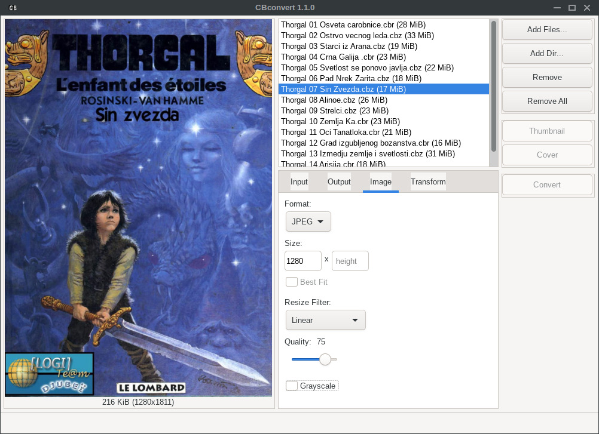
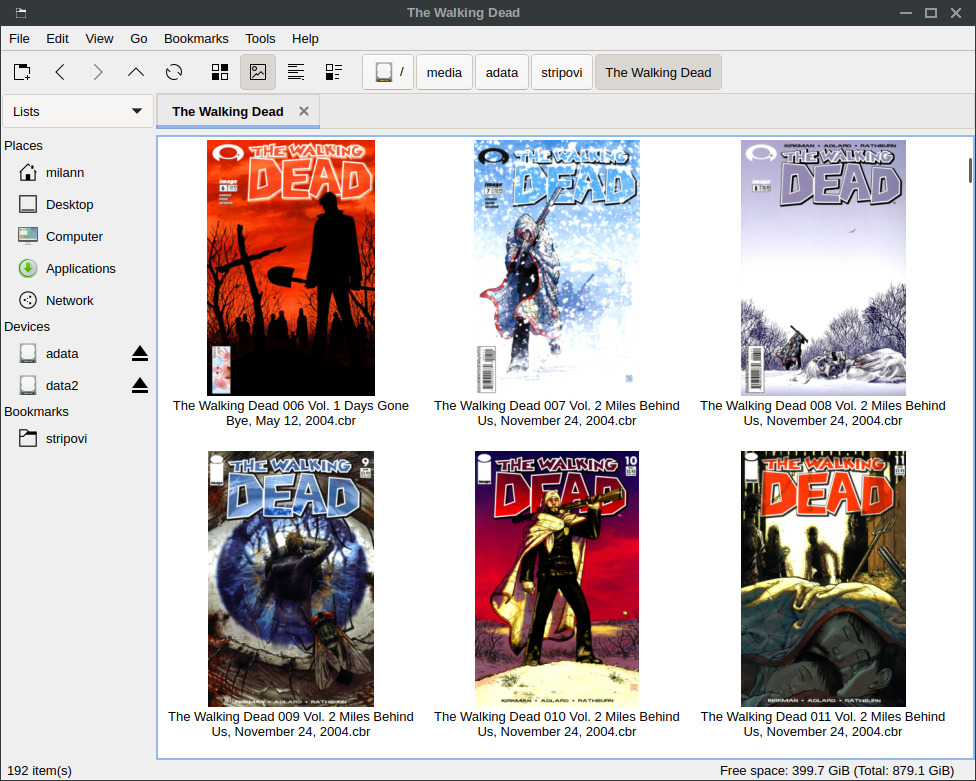

## CBconvert

### Introduction

CBconvert is a [Comic Book](http://en.wikipedia.org/wiki/Comic_Book_Archive_file) converter.

It can convert comics to different formats to fit your various devices.



See more [screenshots](https://github.com/gen2brain/cbconvert/blob/master/cmd/cbconvert-gui/screenshots/).

### Features

* reads CBR (RAR), CBZ (ZIP), CB7 (7Z), CBT (TAR), PDF, XPS, EPUB, MOBI, DOCX, PPTX and plain directory
* saves processed files in ZIP archive format or TAR
* images can be converted to JPEG, PNG, TIFF, WEBP, AVIF, JXL, or 4-Bit BMP (16 colors) image format
* rotate, adjust brightness/contrast or grayscale images
* resize filters (NearestNeighbor, Box, Linear, MitchellNetravali, CatmullRom, Gaussian, Lanczos)
* export covers from comics
* create thumbnails from covers by [FreeDesktop](http://specifications.freedesktop.org/thumbnail-spec/thumbnail-spec-latest.html) specification

### Download

Download the latest binaries from the [releases](https://github.com/gen2brain/cbconvert/releases).

Linux Flatpak is available at [Flathub](https://flathub.org/apps/io.github.gen2brain.cbconvert).

### Using cbconvert in file managers to generate FreeDesktop thumbnails

Copy `cbconvert` cli binary to your `PATH`, create file `~/.local/share/thumbnailers/cbconvert.thumbnailer`
and paste content from [thumbnailer](https://github.com/gen2brain/cbconvert/tree/master/cmd/cbconvert-gui/dist/linux/io.github.gen2brain.cbconvert.thumbnailer).

This is what it looks like in the PCManFM file manager:




### Using command line app

```
    Usage: cbconvert <command> [<flags>] [file1 dir1 ... fileOrDirN]


    Commands:

      convert
            Convert archive or document

        --width
            Image width (default "0")
        --height
            Image height (default "0")
        --fit
            Best fit for required width and height (default "false")
        --format
            Image format, valid values are jpeg, png, tiff, bmp, webp, avif, jxl (default "jpeg")
        --archive
            Archive format, valid values are zip, tar (default "zip")
        --quality
            Image quality (default "75")
        --filter
            0=NearestNeighbor, 1=Box, 2=Linear, 3=MitchellNetravali, 4=CatmullRom, 6=Gaussian, 7=Lanczos (default "2")
        --no-cover
            Do not convert the cover image (default "false")
        --no-rgb
            Do not convert images that have RGB colorspace (default "false")
        --no-nonimage
            Remove non-image files from the archive (default "false")
        --no-convert
            Do not transform or convert images (default "false")
        --grayscale
            Convert images to grayscale (monochromatic) (default "false")
        --rotate
            Rotate images, valid values are 0, 90, 180, 270 (default "0")
        --brightness
            Adjust the brightness of the images, must be in the range (-100, 100) (default "0")
        --contrast
            Adjust the contrast of the images, must be in the range (-100, 100) (default "0")
        --suffix
            Add suffix to file basename (default "")
        --outdir
            Output directory (default ".")
        --size
            Process only files larger than size (in MB) (default "0")
        --recursive
            Process subdirectories recursively (default "false")
        --quiet
            Hide console output (default "false")

      cover
            Extract cover

        --width
            Image width (default "0")
        --height
            Image height (default "0")
        --fit
            Best fit for required width and height (default "false")
        --format
            Image format, valid values are jpeg, png, tiff, bmp, webp, avif, jxl (default "jpeg")
        --quality
            Image quality (default "75")
        --filter
            0=NearestNeighbor, 1=Box, 2=Linear, 3=MitchellNetravali, 4=CatmullRom, 6=Gaussian, 7=Lanczos (default "2")
        --outdir
            Output directory (default ".")
        --size
            Process only files larger than size (in MB) (default "0")
        --recursive
            Process subdirectories recursively (default "false")
        --quiet
            Hide console output (default "false")

      thumbnail
            Extract cover thumbnail (freedesktop spec.)

        --width
            Image width (default "0")
        --height
            Image height (default "0")
        --fit
            Best fit for required width and height (default "false")
        --filter
            0=NearestNeighbor, 1=Box, 2=Linear, 3=MitchellNetravali, 4=CatmullRom, 6=Gaussian, 7=Lanczos (default "2")
        --outdir
            Output directory (default ".")
        --outfile
            Output file (default "")
        --size
            Process only files larger than size (in MB) (default "0")
        --recursive
            Process subdirectories recursively (default "false")
        --quiet
            Hide console output (default "false")

      meta
            CBZ metadata

        --cover
            Print cover name (default "false")
        --comment
            Print zip comment (default "false")
        --comment-body
            Set zip comment (default "")
        --file-add
            Add file to archive (default "")
        --file-remove
            Remove file(s) from archive (glob pattern, i.e. *.xml) (default "")

```

### Examples

* Rescale images to 1200px for all supported files found in a directory with a size larger than 60MB:

`cbconvert --recursive --width 1200 --size 60 /media/comics/Thorgal/`

* Convert all images in pdf to 4bit BMP images and save the result in ~/comics directory:

`cbconvert --format bmp --outdir ~/comics /media/comics/Garfield/Garfield_01.pdf`

[BMP](http://en.wikipedia.org/wiki/BMP_file_format) format is a very good choice for black&white pages. Archive size can be smaller 2-3x and the file will be readable by comic readers.

* Extract covers to ~/covers dir for all supported files found in the directory, Lanczos algorithm is used for resizing:

`cbconvert cover --outdir ~/covers --filter=7 /media/comics/GrooTheWanderer/`

* Convert all images to AVIF format:

`cbconvert --format avif --quality 50 --width 1280 --outdir ~/comics /media/comics/Misc/`

### Quality settings

This table maps quality settings for JPEG to the respective AVIF and WEBP quality settings:

|              |    |    |    |    |
|--------------|----|----|----|----|
| JPEG quality | 50 | 60 | 70 | 80 |
| AVIF quality | 48 | 51 | 56 | 64 |
| WEBP quality | 55 | 64 | 72 | 82 |

### Compile

Install to `GOBIN`:

`go install github.com/gen2brain/cbconvert/cmd/cbconvert@latest`

For GUI app, check [IUP requirements](https://github.com/gen2brain/iup-go), and then install:

`go install github.com/gen2brain/cbconvert/cmd/cbconvert-gui@latest`
